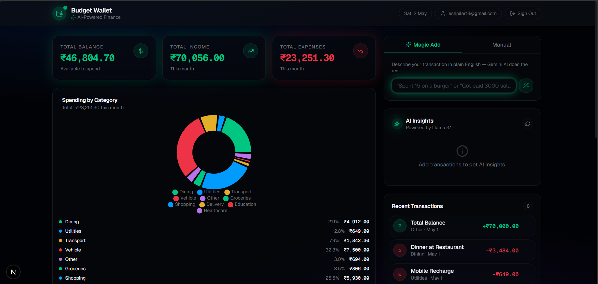
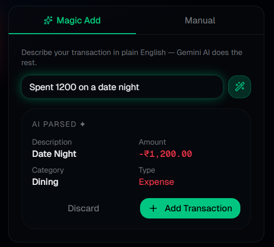
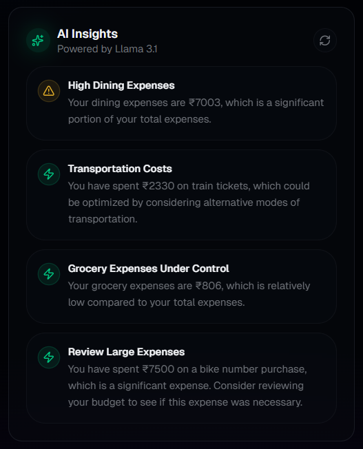

# 💰 Budget Wallet

A modern AI-powered personal finance tracker that helps users manage expenses, visualize spending patterns, and gain insights into their financial habits.

## 🚀 Features

* 📊 Dashboard with total balance, income, and expenses
* 🧠 "Magic Add" – add transactions using natural language
* 📈 Category-based expense visualization
* 🔍 AI-generated financial insights
* 🔐 User authentication system

## 🛠 Tech Stack

* Next.js
* React
* Tailwind CSS
* Supabase (Authentication & Database)

## 📸 Screenshots

### Dashboard



### Magic Add



### Insights


## ⚙️ Run Locally

```bash
git clone https://github.com/Eshaan49/budget-wallet.git
cd budget-wallet
npm install
npm run dev
```
## 💡 Why This Project?

Managing personal finances is often manual and reactive. Budget Wallet aims to make it proactive by using AI-driven insights and intuitive visualization to help users understand and control their spending.

## 🔮 Future Improvements

* Budget alerts
* Recurring expense detection
* Mobile responsiveness
* Advanced analytics

## ⚡ Key Highlights

- Built with modern full-stack architecture (Next.js + Supabase)
- Integrated AI-based natural language transaction input
- Designed interactive financial dashboard with real-time insights
- Focused on user-friendly UI/UX and data visualization
